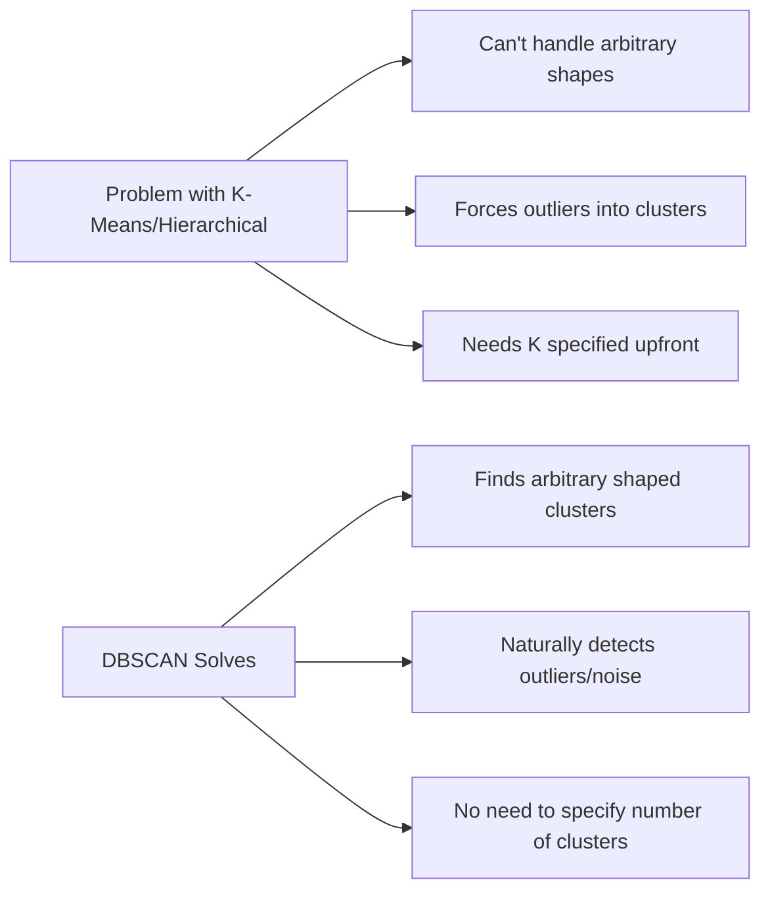
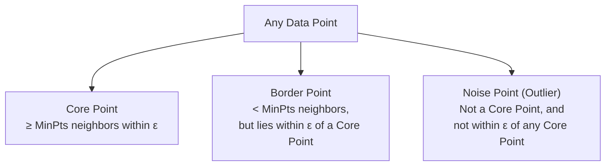
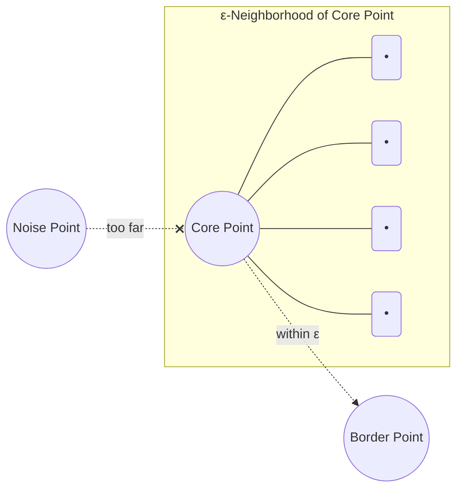
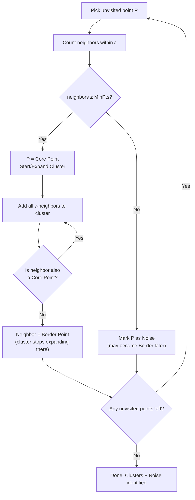
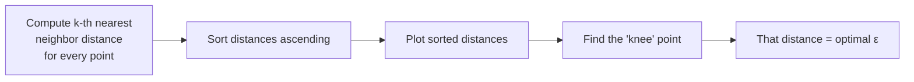
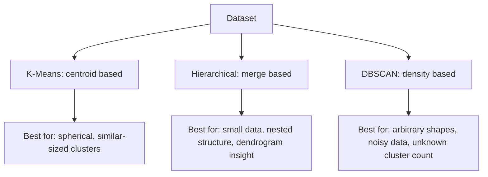
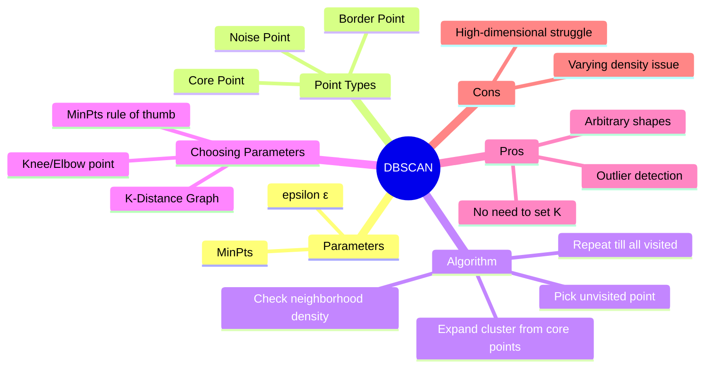

# DBSCAN Clustering — Complete Notes
### Topic: Density-Based Spatial Clustering of Applications with Noise

> **Note:** The video link provided was titled "K Means Clustering Intuition," but the actual video content at that link is about **DBSCAN Clustering** (this is video #73 in the playlist, which fits the natural sequence: K-Means → Hierarchical → DBSCAN). These notes cover DBSCAN as that is the real content of the linked video.

---

## 1. Why DBSCAN? (Motivation)

K-Means and Hierarchical Clustering both struggle with:
- **Non-spherical / irregular shaped clusters**
- **Outliers / noise** (they force every point into some cluster)
- Needing to **specify K** in advance (K-Means)

**DBSCAN** solves these problems by clustering based on **density** of points, not distance to a centroid.



### Visual: Why density-based matters

```
K-Means would fail here (non-convex shapes):

   ********                    ........
  *        *                  .        .
 *          *                .  noise   .
  *        *     • • •         .   *    .
   ********     •     •          ........
                 • • •
   (moon shape)   (circle)     DBSCAN correctly
                                separates these
                                AND ignores stray
                                noise points
```

---

## 2. Core Concepts & Terminology

DBSCAN needs **2 parameters**:

| Parameter | Meaning |
|---|---|
| **ε (epsilon)** | Radius of the neighborhood circle around a point |
| **MinPts (minimum points)** | Minimum number of points required inside that ε-radius circle to consider a region "dense" |

### Point Classifications



1. **Core Point** — A point that has **at least `MinPts`** other points within its ε-radius (including itself, depending on convention).
2. **Border Point** — A point that has **fewer than `MinPts`** neighbors within ε, but it falls within the ε-neighborhood of some Core Point.
3. **Noise Point (Outlier)** — A point that is **neither** a Core Point **nor** within ε-distance of any Core Point. These are left **unclustered**.

### Visual: Core / Border / Noise

```
            ε
        ┌───────┐
        │ • •   │
        │  •(C) •│   (C) = Core Point → has ≥ MinPts(say 4) neighbors inside circle
        │ •  •  │
        └───────┘

        ┌───────┐
        │       │
        │  (B)• │    (B) = Border Point → < MinPts neighbors itself,
        │   •   │            but sits inside a Core Point's ε circle
        └───────┘

           (N)               (N) = Noise → isolated, no nearby cluster,
        far from              not enough neighbors, not in any Core's reach
        everything
```



---

## 3. The DBSCAN Algorithm — Step by Step

**STEP 1:** Pick an arbitrary unvisited point `P` from the dataset.

**STEP 2:** Find all points within **ε-distance** of `P` (its neighborhood).

**STEP 3:**
- If the neighborhood has **≥ MinPts** points → `P` becomes a **Core Point**, and a **new cluster** is started.
- If not → mark `P` as **Noise** *(for now — it may later become a Border Point if a Core Point reaches it)*.

**STEP 4:** If `P` is a Core Point, **expand the cluster**:
- Add all points in `P`'s ε-neighborhood to the cluster.
- For each of those neighboring points, **check if they are also Core Points**. If yes, recursively add **their** neighbors too (density-connected expansion).

**STEP 5:** Continue until the cluster cannot grow anymore (no more density-connected Core Points left to explore).

**STEP 6:** Move to the next unvisited point and repeat Steps 1–5 until **all points have been visited**.

**RESULT:** Every point is now labeled as part of a Cluster, or as Noise.



---

## 4. Step-by-Step Visual Walkthrough (Example)

```
Step 1: Start with random unvisited point P
                      
        •   •
      •   P   •  •
        •   •      •
              •  •

Step 2: Draw ε circle around P, count neighbors
                 ___
        •   • /     \
      •  (P)  •  •   |   →  4 neighbors found inside circle
        •   • \ ___ /      (say MinPts = 4 → P is a Core Point!)
              •  •

Step 3: Expand cluster — visit each neighbor,
        check if THEY are also core points, keep growing
        
        [• • • P • •]  ← all density-connected points merge into ONE cluster
              •  •  ← these become Border Points (cluster edge)

Step 4: Isolated point far away with no nearby cluster
        
                                    •  ← Noise Point (stays unclustered)
        [cluster region above]
```

---

## 5. Choosing the Parameters (ε and MinPts)

This is the most important practical skill for using DBSCAN well.

### Choosing MinPts
- Rule of thumb: **MinPts ≥ Dimensions + 1**
- For 2D data, a common choice is **MinPts = 4**
- Larger/noisier datasets → use a larger MinPts

### Choosing ε — The K-Distance Graph Method

1. For every point, compute the distance to its **k-th nearest neighbor** (k = MinPts).
2. Sort these distances in **ascending order** and plot them.
3. Look for the **"knee" / "elbow"** in the curve — the ε value at that knee is the ideal choice.



### K-Distance Graph (conceptual)

```
 k-distance
    |
    |                                    ___________
    |                          _________/
    |                    _____/
    |              ______/
    |          ___/
    |      ___/
    |   __/
    | _/
    |/______________________________________________ 
       points sorted by distance (ascending)
              ↑
         "knee" point → value on y-axis here = best ε
```
- Before the knee: points are close together (dense regions).
- After the knee: distances spike up sharply (sparse regions / noise).
- The knee marks the natural separation between "in a cluster" and "noise."

---

## 6. DBSCAN vs K-Means vs Hierarchical — Comparison

| Feature | K-Means | Hierarchical | DBSCAN |
|---|---|---|---|
| Need K upfront? | Yes | No (but pick via dendrogram) | **No** |
| Handles non-spherical shapes? | No | Partially | **Yes** |
| Handles outliers/noise? | No (forces into clusters) | No | **Yes (explicitly labels noise)** |
| Key parameters | K | Linkage method | **ε, MinPts** |
| Sensitive to density variation | N/A | N/A | **Yes** (struggles if clusters have very different densities) |
| Deterministic | No (depends on init) | Yes | Yes (mostly, with fixed parameters) |
| Scalability | Good | Poor for large data | Good (with spatial indexing) |



---

## 7. Advantages & Limitations

### ✅ Advantages
- No need to specify the number of clusters beforehand.
- Can find **arbitrarily shaped** clusters (not just circular/spherical).
- **Robust to outliers** — explicitly identifies and excludes noise.
- Only 2 parameters to tune (ε, MinPts).

### ⚠️ Limitations
- Struggles when clusters have **very different densities** (a single ε doesn't fit all).
- Choosing the right **ε and MinPts** can be tricky and dataset-dependent.
- Performance can degrade in **very high-dimensional data** (distance becomes less meaningful — "curse of dimensionality").

---

## 8. Quick Revision Cheat-Sheet

1. DBSCAN = **D**ensity-**B**ased **S**patial **C**lustering of **A**pplications with **N**oise.
2. Two parameters: **ε** (neighborhood radius) and **MinPts** (minimum neighbors for density).
3. Three point types: **Core**, **Border**, **Noise**.
4. Algorithm: pick point → check density → expand cluster from Core Points → repeat → leftover points = Noise.
5. Use the **K-Distance Graph** (find the "knee") to choose the best ε.
6. Best suited for: irregular-shaped clusters + datasets with outliers + unknown number of clusters.
7. Weak point: clusters with **varying density** in the same dataset.

---

## 9. Master Mind-Map



---
*Notes compiled for mastering DBSCAN Clustering — covers core concepts, algorithm steps, parameter selection, and visual intuition, plus comparison with K-Means and Hierarchical Clustering.*