# Clustering — Complete Notes
### Topics: K-Means Clustering Intuition & Hierarchical Clustering Intuition

---

## 0. What is Clustering? (Common Foundation)

**Clustering** is an **unsupervised learning** technique. Unlike classification, there are **no labels** in the data — the algorithm itself discovers groups ("clusters") of similar data points.

> Goal: Group data points such that points in the **same cluster** are very similar to each other, and points in **different clusters** are very different.

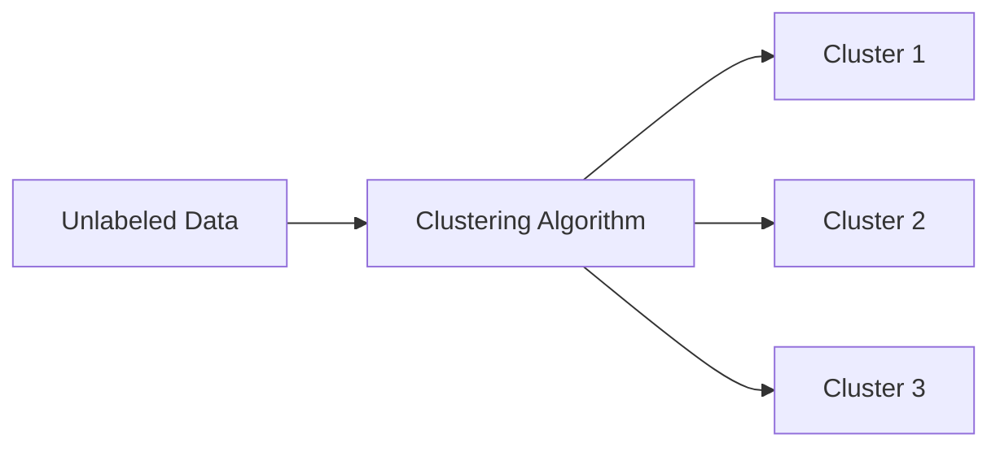

Two major clustering algorithms covered here:
1. **K-Means Clustering**
2. **Hierarchical Clustering**

---

# PART 1: K-MEANS CLUSTERING INTUITION

## 1.1 Core Idea

K-Means tries to partition `n` data points into `K` clusters, where each point belongs to the cluster with the **nearest mean (centroid)**.

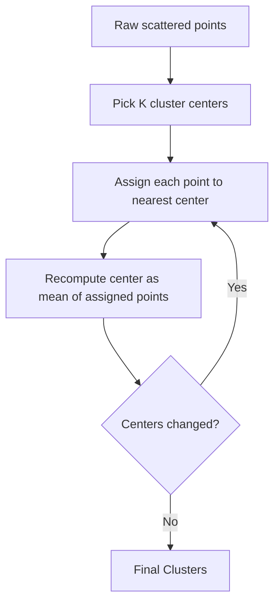

## 1.2 The K-Means Algorithm — Step by Step

**STEP 1:** Choose the number of clusters `K`.

**STEP 2:** Select `K` random points as the initial **centroids** (not necessarily from your dataset).

**STEP 3:** Assign each data point to the **closest centroid** → this forms `K` clusters.
- Distance is usually **Euclidean Distance**:
  
  $$d(P_1, P_2) = \sqrt{(x_2-x_1)^2 + (y_2-y_1)^2}$$

**STEP 4:** Recompute and place the new centroid of each cluster (mean of all points in that cluster).

**STEP 5:** Reassign each point to the new closest centroid. If any reassignment happened → go back to **STEP 4**. Otherwise → **STOP**, model is ready.

### Visual Walkthrough

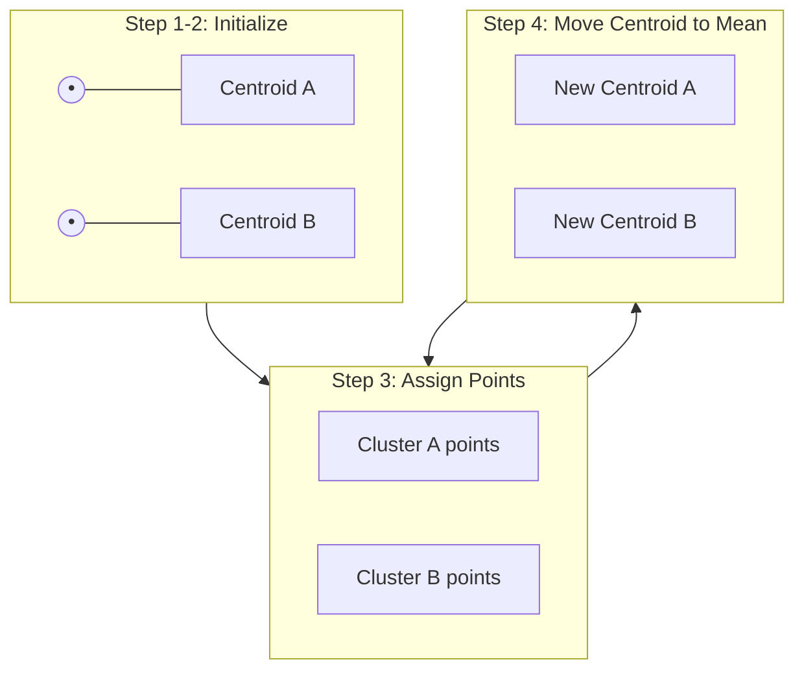

### Scatter Plot Visualization (conceptual)

```
   Before Clustering              After K-Means (K=2)

    •   •                          A   A
  •   •    •                     A   A    B
     •   •      •                  A   B      B
   •    •   •                    A    B   B
        •  •  •                       B  B  B
```
- Left: unlabeled scattered points.
- Right: Same points colored/grouped into Cluster A and Cluster B with centroids marked (✕).

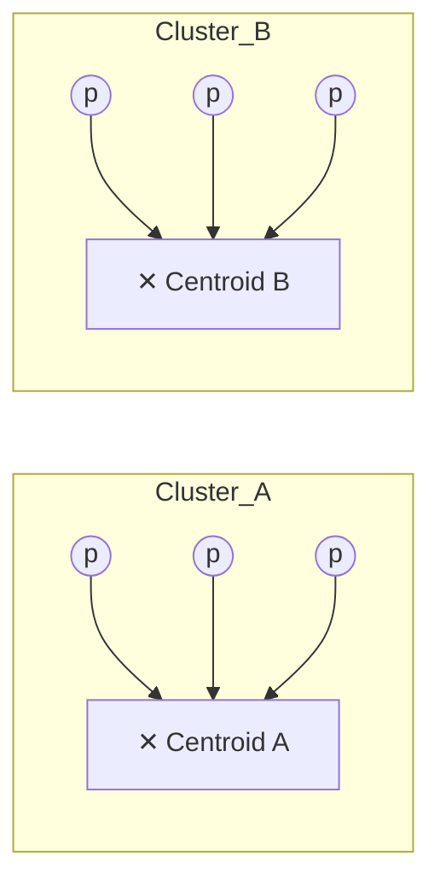

## 1.3 Random Initialization Trap ⚠️

**Problem:** If initial centroids are chosen poorly (purely randomly), K-Means can converge to a **bad/sub-optimal clustering** (different runs may give different results).

**Example of the trap:**


**Solution → K-Means++**
- A smarter initialization algorithm.
- Selects initial centroids that are **far apart from each other**, reducing the chance of bad convergence.
- In practice (e.g., scikit-learn), this is the **default** initialization method: `init='k-means++'`.

## 1.4 Choosing the Right Number of Clusters (K) — The Elbow Method

The biggest question in K-Means: **"How many clusters (K) should I choose?"**

### Within-Cluster Sum of Squares (WCSS)

WCSS measures how "tight" the clusters are — sum of squared distances between each point and its cluster's centroid.

$$WCSS = \sum_{Cluster\ 1} \text{dist}(P_i, C_1)^2 + \sum_{Cluster\ 2} \text{dist}(P_i, C_2)^2 + \dots$$

**Key fact:** As K increases, WCSS **always decreases**.
- K = number of data points → WCSS = 0 (every point is its own cluster — overfitting, useless).
- K = 1 → WCSS is at its maximum.

### The Elbow Method Process

1. Run K-Means for K = 1, 2, 3, 4, 5, ... n
2. Calculate WCSS for each K
3. Plot K (x-axis) vs WCSS (y-axis)
4. Look for the **"elbow point"** — where the rate of decrease sharply slows down.

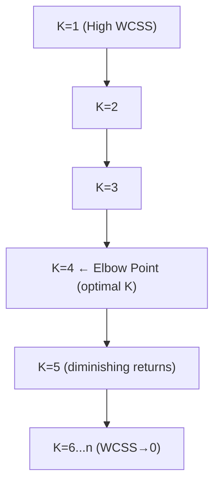

### WCSS vs K Graph (conceptual)

```
 WCSS
  |
  |\
  | \
  |  \
  |   \
  |    \___          <-- "elbow" (sharp bend) → optimal K here
  |        \___
  |            \________________
  |_________________________________ K
    1   2   3   4   5   6   7   8
```
- The point where the curve bends like an elbow (here around K=3 or 4) is the best trade-off between minimizing WCSS and not overfitting with too many clusters.

## 1.5 K-Means Summary Table

| Aspect | Detail |
|---|---|
| Type | Unsupervised, Centroid-based clustering |
| Distance metric | Usually Euclidean |
| Need to specify K? | Yes, in advance |
| Initialization issue | Random Initialization Trap |
| Fix | K-Means++ |
| Choosing optimal K | Elbow Method using WCSS |
| Sensitive to outliers? | Yes (mean shifts with outliers) |
| Cluster shape assumption | Roughly spherical/convex clusters |

---

# PART 2: HIERARCHICAL CLUSTERING INTUITION

## 2.1 Two Types of Hierarchical Clustering

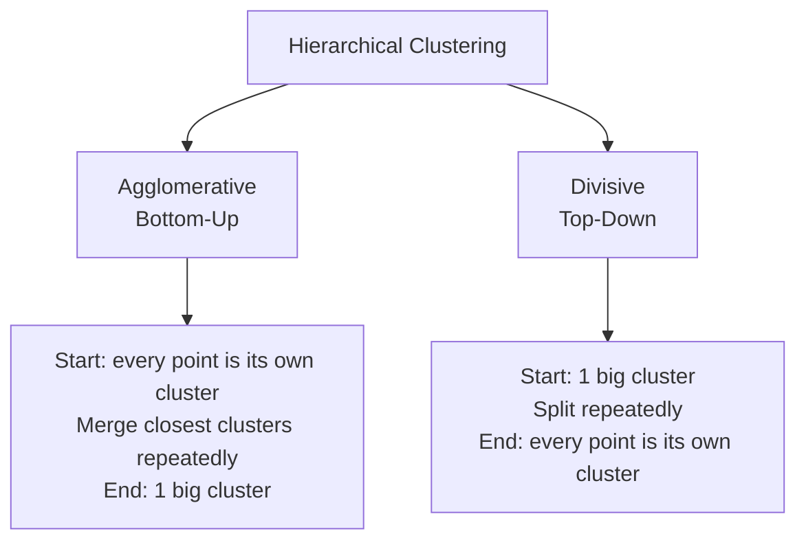

> **Agglomerative** is the more common and the one mainly discussed (bottom-up approach).

## 2.2 Agglomerative Hierarchical Clustering — Step by Step

**STEP 1:** Make each data point a single-point cluster → forms `N` clusters (N = number of data points).

**STEP 2:** Take the two **closest** data points/clusters and merge them into one cluster → now `N-1` clusters.

**STEP 3:** Take the two closest clusters and merge them → now `N-2` clusters.

**STEP 4:** Repeat Step 3 until only **one single cluster** remains.

**FINISH** — you now have the complete merge history, which is visualized as a **Dendrogram**.

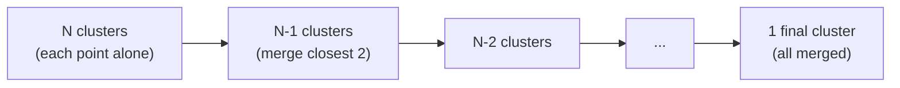

### Visual: Step-by-step merging on points

```
Step 1 (N clusters):     •1  •2  •3  •4  •5

Step 2 (merge closest):  [•1 •2]  •3  •4  •5

Step 3:                  [•1 •2]  [•3 •4]  •5

Step 4:                  [•1 •2]  [•3 •4 •5]

Step 5 (final):          [•1 •2 •3 •4 •5]
```

## 2.3 Measuring Distance Between Clusters

When clusters have more than 1 point, "distance between clusters" can be measured in 4 main ways:

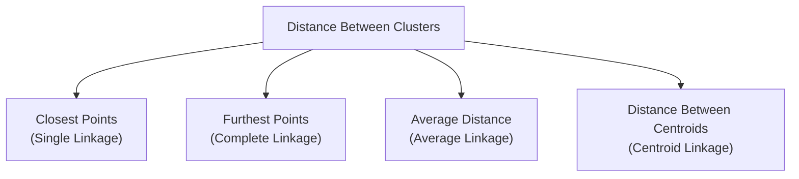

| Method | Definition |
|---|---|
| **Single Linkage** | Minimum distance between any pair of points (one from each cluster) |
| **Complete Linkage** | Maximum distance between any pair of points (one from each cluster) |
| **Average Linkage** | Average of all pairwise distances between points of the two clusters |
| **Centroid Linkage** | Distance between the centroids (means) of the two clusters |

### Visual: Linkage Types

```
Cluster A (•a1 •a2)        Cluster B (•b1 •b2)

Single Linkage   : shortest line between any •a and •b
Complete Linkage : longest line between any •a and •b
Average Linkage  : average of ALL •a–•b line lengths
Centroid Linkage : line between mean(A) and mean(B)
```

## 2.4 Dendrograms — The Memory of Hierarchical Clustering

A **Dendrogram** is a tree-like diagram that records the **sequence and distance** of every merge that happened during clustering. It is the core visual tool for Hierarchical Clustering.

- **X-axis:** Individual data points
- **Y-axis:** **Euclidean Distance** between the clusters being merged
- **Height of each "U" shape (bracket)** = the distance at which two clusters were merged. Taller bracket = the merged clusters were further apart (more dissimilar).

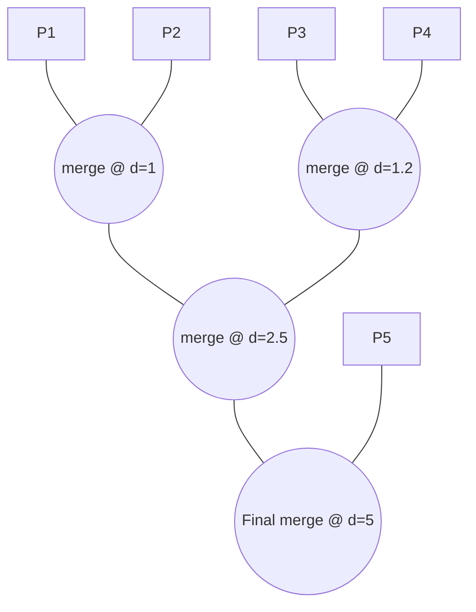

### Conceptual Dendrogram Diagram

```
Distance
  |
5 |                       ___________________
  |                      |                   |
2.5|              _______|____               |
  |             |             |              |
1.2|         ___|___          |              |
  |        |       |          |              |
1.0|    ___|___     |          |              |
  |   |       |     |          |              |
  |  P1      P2     P3        P4              P5
```
- Lower merges (small Y value) = points that are very similar.
- Higher merges (large Y value) = clusters that are quite different but still got grouped at the end.

## 2.5 How to Use a Dendrogram to Find the Optimal Number of Clusters

This is the **most important practical use** of a dendrogram.

### Method: "Largest Distance Trick"

**STEP 1:** Find the **longest vertical line** in the dendrogram that is **not crossed** by any horizontal merge line (i.e., the largest gap with no intersections).

**STEP 2:** Draw a **horizontal threshold line** through that longest uncrossed vertical line.

**STEP 3:** Count the number of vertical lines this threshold line crosses → that number = **optimal number of clusters**.

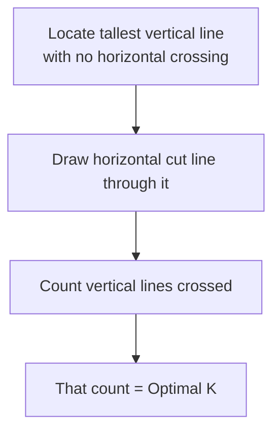

### Visual Example

```
Distance
  |
  |          ┌──────────────────────────┐
  |  threshold line cuts here (longest gap)
  |          |                          |
  |     ┌────┴────┐                ┌────┴────┐
  |     |         |                |         |
  |   ┌─┴─┐      ┌┴┐              ┌┴┐       ┌┴─┐
  |   |   |      | |              | |       |  |
  P1  P2  P3     P4 P5            P6 P7      P8 P9
```
- Suppose the threshold horizontal line crosses **3 vertical lines** → optimal number of clusters = **3**.

## 2.6 K-Means vs Hierarchical Clustering — Comparison

| Feature | K-Means | Hierarchical (Agglomerative) |
|---|---|---|
| Need to specify clusters upfront? | Yes (K) | No — decided after building dendrogram |
| Approach | Centroid-based, iterative | Bottom-up merging |
| Scalability | Faster, better for large datasets | Slower (O(n²) or more), better for smaller datasets |
| Visualization tool | Elbow graph (WCSS vs K) | Dendrogram |
| Outlier sensitivity | High | Lower (depends on linkage method) |
| Reproducibility | Can vary due to random init (fixed by K-Means++) | Deterministic (same result every run) |
| Cluster shape | Assumes globular/spherical clusters | Can capture more complex/nested structures |

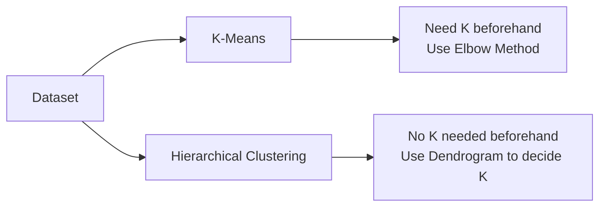

---

## 3. Quick Revision Cheat-Sheet

### K-Means
1. Pick K → place K random centroids
2. Assign points to nearest centroid
3. Recompute centroid (mean)
4. Repeat 2-3 until no change
5. ⚠️ Random Init Trap → fix with **K-Means++**
6. Find optimal K → **Elbow Method** (plot WCSS vs K, find the bend)

### Hierarchical Clustering
1. Start: every point = its own cluster
2. Repeatedly merge the 2 closest clusters
3. Use Linkage method to define "closest": Single / Complete / Average / Centroid
4. Continue till 1 cluster remains
5. Visualize entire merge history as a **Dendrogram**
6. Find optimal clusters → cut dendrogram at the **tallest uncrossed vertical line**, count crossings

---

## 4. Master Mind-Map

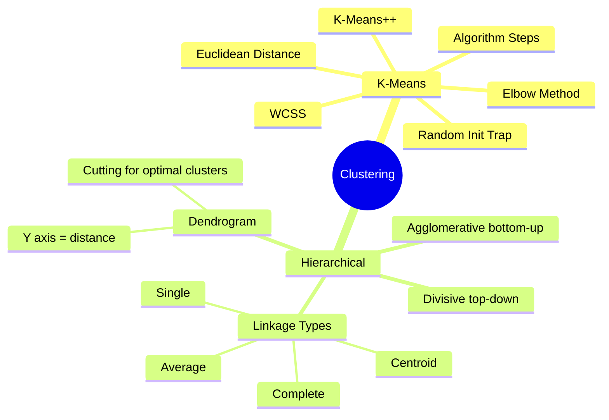

---
*Notes compiled for mastering K-Means and Hierarchical Clustering — covers algorithm steps, pitfalls, optimal cluster selection methods, and visual intuition for both techniques.*